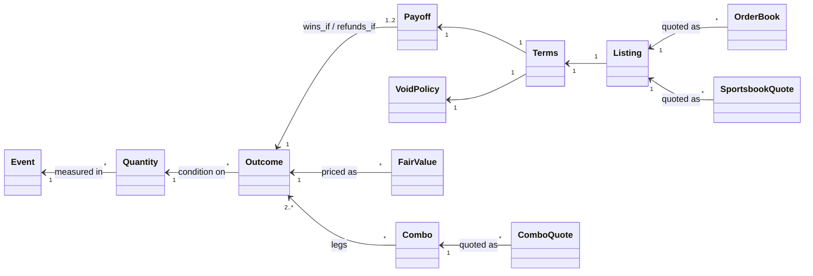

# Canonical domain model

The domain answers one question for every price we see: *which real-world
outcome is this a bet on, and on what terms?* Once every venue's markets map
onto one canonical shape, the things we care about become straightforward
comparisons:

- cross-venue matching,
- ladder and complement consistency checks,
- push probabilities,
- combo correlation.

## The layers

| Concept | Module | Meaning |
|---|---|---|
| `Event`, `League`, `Period` | `sports.py` | Reference data. An event's identity is fixed at creation; delays and postponements are recorded as separate facts. |
| `Quantity` | `propositions.py` | A random variable: *(event, stat, period, team?, player?)*. |
| `Outcome` | `propositions.py` | A yes/no condition on a Quantity. Every price maps onto one of these. |
| `Terms` = `Payoff` + `VoidPolicy` | `terms.py` | How an outcome becomes money at one venue: win, refund, void. |
| `Listing` | `venues.py` | A venue market mapped onto an Outcome plus that venue's Terms. |
| `OrderBook`, `SportsbookQuote` | `quotes.py` | Immutable observations, with timestamps for both when the price was valid and when we recorded it. |
| `FairValue` | `valuation.py` | A probability, its uncertainty, and its lineage. |
| `Combo`, `ComboQuote` | `combos.py` | Parlays and the quotes market makers make on them. |

The key separation is between the **Outcome** (what has to happen) and the
**Terms** (what the venue pays when it does, or when something odd happens).
Two listings are the same bet only when both match.

## Canonical form

Each real-world outcome has exactly one representation, so `==` means "same
outcome". Two rules make that true:

1. **Margin is always home minus away.** "BUF +3.5" is stored as "home margin ≤ 3".
2. **Numeric stats are integers, so conditions use integer bounds.** "Over 3.5",
   "more than 3", and "at least 4" all become `>= 4`.

| Venue says | Canonical outcome | Refund on |
|---|---|---|
| Book: KC −3 | margin ≥ 4 | margin = 3 |
| Kalshi: KC wins by more than 3.5 | margin ≥ 4 | — |
| Book: KC moneyline (2-way) | margin ≥ 1 | margin = 0 |
| Kalshi: KC wins | margin ≥ 1 | — (a tie settles NO) |
| Book: BUF +3.5 | margin ≤ 3 | — |

Rows 1 and 2 are the same outcome with different Terms. The whole difference
between the two prices is the probability of a push, P(margin = 3). That's why
estimating push probability at NFL key numbers is a first-class job for the
fair-value engine.

Adapters must build outcomes with the builders in `propositions.py`: `moneyline`,
`spread`, `margin_exactly`, `total`, and `player_stat`.

## NFL specifics

- **Key numbers.** Margins of 3 and 7 are far more likely than their neighbors,
  so converting an integer book line into an exchange half-point line needs a
  push-probability model. It is not a rounding exercise.
- **Ties.** They are rare but real. A 2-way sportsbook moneyline usually refunds
  on a tie; an exchange "wins" contract settles NO.
- **Overtime.** `FULL_GAME` includes OT and `REGULATION` doesn't. They are
  different random variables, so they are separate periods.
- **Flex scheduling** moves start times. An event's identity doesn't depend on
  its start time.
- **Player absence and stat corrections** vary by venue. Absence is captured in
  `VoidPolicy`; stat-correction windows are a likely next field.

## MLB specifics

- **Listed pitchers.** Many sportsbooks void the bet if either listed starter
  doesn't start; "action" markets don't. This changes the bet, so it is part of
  Terms. A scratched starter is also one of the biggest stale-quote events in the
  sport.
- **Doubleheaders.** Same teams, same date. `game_number` is part of an event's
  identity.
- **Postponements and suspended games.** These follow venue-specific rules, held
  in `VoidPolicy.on_postponement`.
- **Extra innings.** `FULL_GAME` includes them. The runner-on-second rule
  reshapes the distribution of extra-inning runs, which matters for totals and
  run lines.
- **First five innings and first inning** are separate periods, which isolates
  the starting pitchers.

## Next: application-layer ports

- `QuoteSource`: streams `OrderBook` and `SportsbookQuote` observations.
- `ListingResolver`: maps venue markets to `Listing` (entity resolution, with a
  review queue for low-confidence matches).
- `FairValueModel`: turns quotes into `FairValue`.
- `OpportunityDetector`: one per edge type in the principles.
- `ExecutionVenue`, `RiskPolicy`, and `Notifier` (Discord).
